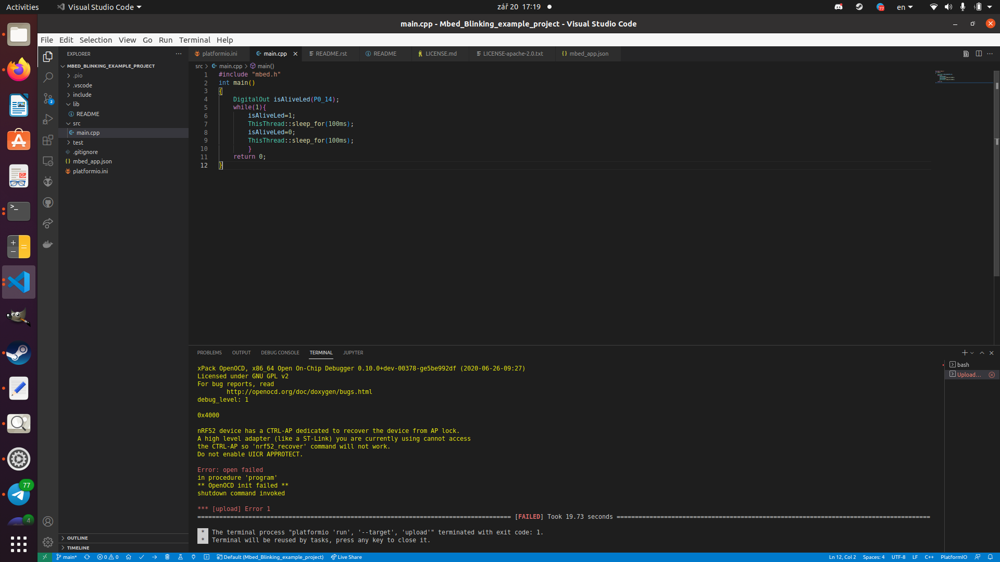
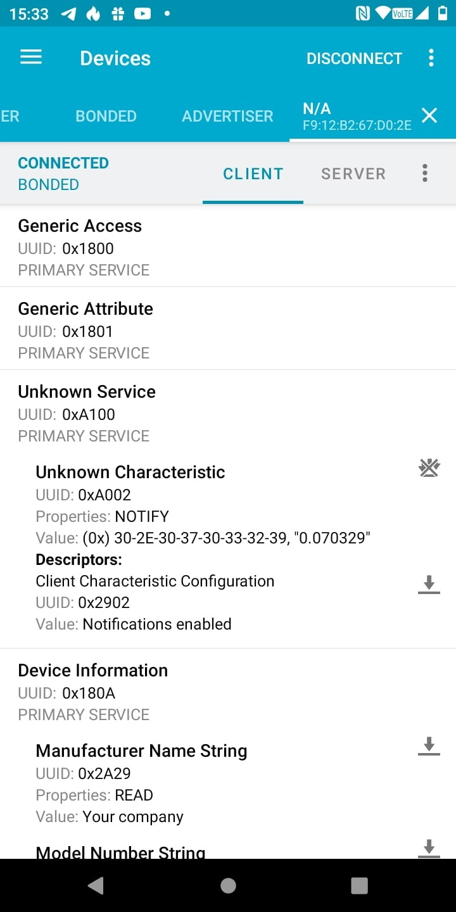

<!-- Short description -->
## Short description
This project presents examples for NRF52840 development board (Green Pill). All the projects are made using PlatformIO extension and Vscode. The board can be flashed using STLINKV2 programmer.
1. Mbed_Blinking_example_project is a classic LED blinking example.
2. Mbed_USBSerial_example_project is an example of using USB peripheral of the board. 
3. Mbed_ADC_BLE_example_project shows how to read data from analog inputs and it send via BLE.

## Flashing 
0. Connect the board to STLINKV2(3,3v->3,3v,GND->GND, SWDIO->SWDIO, SWCLK->SWCLK)
1. Open project folder with Vscode, (Platoformio extension must be installed).
2. Press Ctrl-Alt-U, it will build and upload the project.

3. See the results.

## Mbed_Blinking_example_project
This project is classic led blinking, just flash the code and see how the board LED starts blinking.

## Mbed_USBSerial_example_project
After the flashing the board acts like a virtual COM port, after you open in serial port terminal you should see 'Hello World!!!' message.
If you are using linux you can use gtkterm or any other serial port terminal to view the message.

```sh
gtkterm -p /dev/ttyACM0 115200
```

## Mbed_ADC_BLE_example_project
In this project we read data from P0.02 pin and send it to connected bluetooth device. You can connect to the board using PC or smartphone. When using smartphone try NRFConnect application to immediatly see the data.

